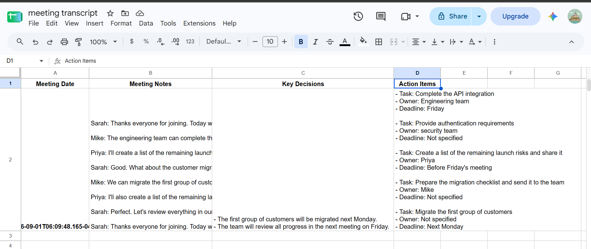

# AI Meeting Notes & Action Item Extractor

An AI-powered meeting automation built with n8n that processes meeting recordings, generates structured meeting insights, extracts key decisions and action items, and automatically stores the results in Google Sheets.

## Overview

This workflow automates the repetitive work of turning meeting recordings into organized, actionable notes.

Instead of manually reviewing a meeting and writing down decisions and tasks, the workflow processes the recording and produces structured output automatically.

## Workflow

Meeting Recording
        ↓
Read Meeting File
        ↓
Prepare Transcript
        ↓
Generate Meeting Summary
        ↓
Prepare AI Output
        ↓
Extract Decisions & Actions
        ↓
Structure Results
        ↓
Google Sheets

## What It Produces

For each meeting, the workflow stores:

- Meeting Date
- Meeting Notes
- Key Decisions
- Action Items
- Task owners
- Deadlines

## Workflow

## Final Output

## Tech Stack

- n8n
- Google Sheets
- Google Gemini
- AI-powered text processing
- Local file processing

## Key Features

### Meeting Processing
Reads a meeting recording from a local file and processes it through the automation.

### AI Summarization
Generates a concise summary of the meeting.

### Decision Extraction
Identifies important decisions made during the meeting.

### Action Item Extraction
Extracts tasks along with available owners and deadlines.

### Automated Storage
Automatically writes the structured results into Google Sheets.

## Example Output

| Meeting Date | Meeting Notes | Key Decisions | Action Items |
|---|---|---|---|
| 2026-09-01 | Meeting transcript and summary | Customer migration scheduled for Monday | Complete API integration — Engineering — Friday |

## Business Use Case

This automation can help:

- Teams document meetings automatically
- Managers track decisions
- Project teams follow up on assigned tasks
- Operations teams maintain centralized meeting records
- Businesses reduce manual meeting documentation

## Setup

1. Install and run n8n.
2. Configure the required AI credentials.
3. Configure Google Sheets credentials.
4. Provide a meeting recording.
5. Configure the Google Sheets destination.
6. Execute the workflow.

## Security

Do not commit:

- API keys
- OAuth credentials
- `.env` files
- Private meeting recordings
- Personal or confidential meeting data

Credentials should be configured directly inside n8n.

## Future Improvements

- Automatic cloud file ingestion
- Support for additional audio formats
- Automatic meeting title detection
- Separate action-item rows
- Email/Slack notifications
- Calendar integration
- Automatic task creation in project-management systems

## Author

Built as an AI automation portfolio project demonstrating workflow automation, AI information extraction, and business-process automation with n8n.
